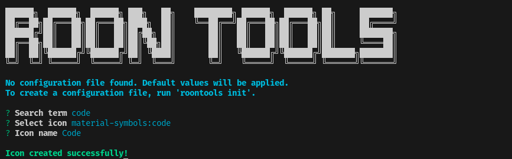
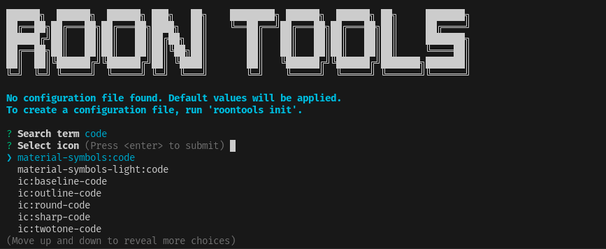
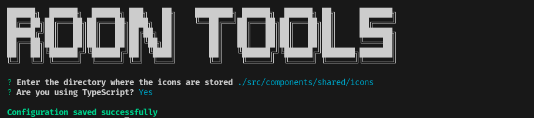
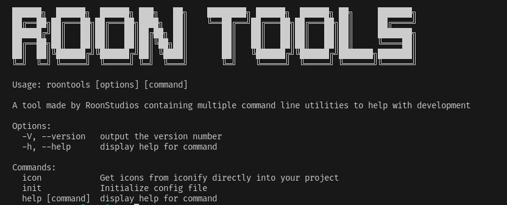

# Roon Tools
  
A tool made by RoonStudios containing multiple command line utilities to help with development

## Installation

```sh
npm i -g roontools
# or
pnpm add -g roontools
# or
yarn global add roontools
```

## Usage

### Icon
```
Usage: roontools icon [options]

Get icons from iconify directly into your project

Options:
  -h, --help  display help for command

```

### Init
```
Usage: roontools init [options]

Initialize config file

Options:
  -h, --help  display help for command

```


## Upcoming Features

check [The todo file](TODO.md) for more info 

## Screenshots




